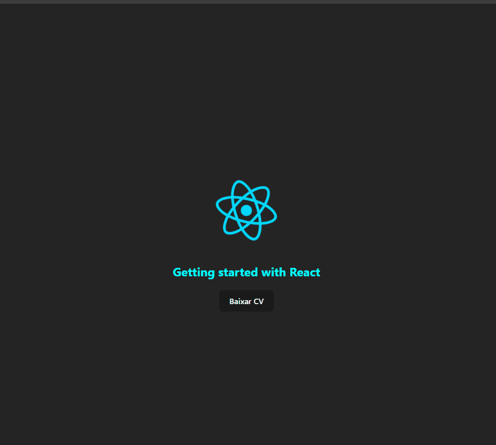

# Quest - Styling and Event click

### 📜 Descrição:

    Objetivo principal: treinar o Básico do React.
    Primeiro objetivo: Criar um componente e estilizar ele para deixar ele colorido e com letras maiúsculas.
    Segundo objetivo: Criar um componente tipo button para que ao clicar apareça uma mensagem no meu caso troquei a mensagem para "Você está baixando o CV"

### 🚀 Tecnologias Utilizadas:

    
    
    
    

### 📸 Preview

